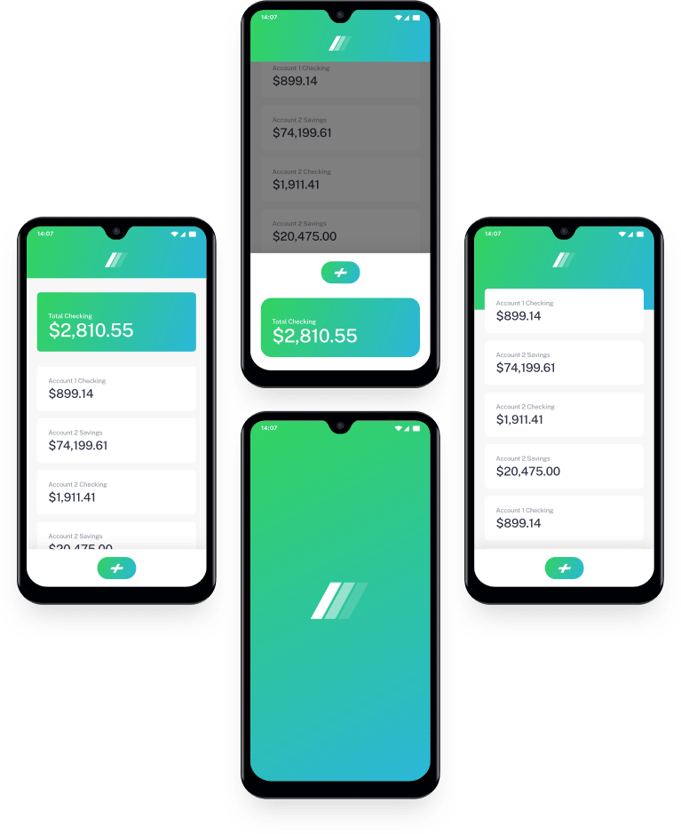

# Frontend Mentor - Easybank landing page solution

This is a solution to the [Easybank landing page challenge on Frontend Mentor](https://www.frontendmentor.io/challenges/easybank-landing-page-WaUhkoDN). Frontend Mentor challenges help you improve your coding skills by building realistic projects.

## Table of contents

- [Overview](#overview)
  - [The challenge](#the-challenge)
  - [Screenshot](#screenshot)
  - [Links](#links)
- [My process](#my-process)
  - [Built with](#built-with)
  - [What I learned](#what-i-learned)
  - [Continued development](#continued-development)
  - [Useful resources](#useful-resources)
- [Author](#author)
- [Acknowledgments](#acknowledgments)


## Overview

### The challenge

Users should be able to:

- View the optimal layout for the site depending on their device's screen size
- See hover states for all interactive elements on the page

### Screenshot


only responsive min-width: 1024px for desktop
and max-width:430px for mobiles

desktopView :


mobileView:


### Links

- Solution URL: [Add solution URL here](https://your-solution-url.com)
- Live Site URL: [Add live site URL here](https://your-live-site-url.com)

## My process

### Built with

- Semantic HTML5 markup
- CSS custom properties
- Flexbox
- CSS Grid
- Mobile-first workflow
- Sass
- vanila JS


### What I learned

One of the key challenges I faced in this project was achieving the desired mockup image overflow effect while ensuring proper positioning within its container. The goal was to allow the mockup to extend beyond its section in a controlled way while preventing unwanted horizontal overflow.

How I Solved It
To address this, I researched CSS positioning and found that using a combination of position: relative; on the parent and position: absolute; with z-index on the child element allowed me to achieve the effect while keeping the layout structured.


```html
<div class="content-container">
  
   <div class="text-container">
        <h1>Next generation digital banking</h1>
        <p>Lorem ipsum dolor sit amet consectetur adipisicing elit.ecati tempora placeat commodi officia molestiae?
            Lorem, ipsum dolor sit amet.
        </p>
        <button id="button_sided">Request Invite</button>
    </div>

 

<div class="svg-sided">
    <svg id="des-intro"  xmlns="http://www.w3.org/2000/svg" xmlns:xlink="http://www.w3.org/1999/xlink" width="1050" height="700"><defs><linearGradient id="c" x1="0%" x2="99.58%" y1="36.147%" y2="63.736%"><stop offset="0%" stop-color="#33D35E"/><stop offset="100%" stop-color="#2AB6D9"/></linearGradient><filter id="a" width="104.9%" height="135.9%" x="-4.8%" y="-17.6%" filterUnits="objectBoundingBox"><feOffset dy="2" in="SourceAlpha" result="shadowOffsetOuter1"/><feGaussianBlur in="shadowOffsetOuter1" result="shadowBlurOuter1" stdDeviation="38.5"/><feColorMatrix in="shadowBlurOuter1" values="0 0 0 0 0 0 0 0 0 0 0 0 0 0 0 0 0 0 0.0240111451 0"/></filter><path id="b" d="M69.445 572.84L203.73 707.112a100 100 0 0070.708 29.286h70.693a100 100 0 0170.708 29.287l161.04 161.027A100 100 0 00647.584 956h388.853c44.964 0 81.415-36.45 81.415-81.414a81.414 81.414 0 00-23.848-57.57l-86.392-86.386c-12.033-12.032-12.034-31.54-.002-43.574a30.812 30.812 0 0121.788-9.025c17.017 0 30.812-13.795 30.812-30.812 0-8.172-3.246-16.01-9.025-21.788L855.85 430.11a100 100 0 00-70.708-29.287H550.7a100 100 0 01-70.708-29.287l-35.253-35.25A100 100 0 00374.032 307H138.88c-31.769 0-57.523 25.754-57.523 57.523a57.523 57.523 0 0016.85 40.676l28.761 28.76c15.886 15.884 15.887 41.64.003 57.525a40.676 40.676 0 01-28.764 11.915c-22.465 0-40.677 18.211-40.677 40.676a40.676 40.676 0 0011.915 28.764z"/></defs><g fill="none" fill-rule="evenodd" transform="translate(15)"><use fill="#000" filter="url(#a)" xlink:href="#b"/><use fill="#2D314D" xlink:href="#b"/><path fill="url(#c)" d="M207.445 265.84L341.73 400.112a100 100 0 0070.708 29.286h70.693a100 100 0 0170.708 29.287l161.04 161.027A100 100 0 00785.584 649h388.853c44.964 0 81.415-36.45 81.415-81.414a81.414 81.414 0 00-23.848-57.57l-86.392-86.386c-12.033-12.032-12.034-31.54-.002-43.574a30.812 30.812 0 0121.788-9.025c17.017 0 30.812-13.795 30.812-30.812 0-8.172-3.246-16.01-9.025-21.788L993.85 123.11a100 100 0 00-70.708-29.287H688.7a100 100 0 01-70.708-29.287l-35.253-35.25A100 100 0 00512.032 0H276.88c-31.769 0-57.523 25.754-57.523 57.523a57.523 57.523 0 0016.85 40.676l28.761 28.76c15.886 15.884 15.887 41.64.003 57.525a40.676 40.676 0 01-28.764 11.915c-22.465 0-40.677 18.211-40.677 40.676a40.676 40.676 0 0011.915 28.764z"/></g></svg>
<svg id="mobile-intro" xmlns="http://www.w3.org/2000/svg" xmlns:xlink="http://www.w3.org/1999/xlink" width="375" height="423"><defs><linearGradient id="c" x1="0%" x2="99.58%" y1="36.139%" y2="63.745%"><stop offset="0%" stop-color="#33D35E"/><stop offset="100%" stop-color="#2AB6D9"/></linearGradient><filter id="a" width="116.9%" height="158.7%" x="-10.8%" y="-28.8%" filterUnits="objectBoundingBox"><feOffset dy="2" in="SourceAlpha" result="shadowOffsetOuter1"/><feGaussianBlur in="shadowOffsetOuter1" result="shadowBlurOuter1" stdDeviation="38.5"/><feColorMatrix in="shadowBlurOuter1" values="0 0 0 0 0 0 0 0 0 0 0 0 0 0 0 0 0 0 0.0240111451 0"/></filter><path id="b" d="M42.46 162.61l70.744 70.76a100 100 0 0070.719 29.298h11.03a100 100 0 0170.719 29.298l75.718 75.736A100 100 0 00412.109 397H633.78c27.507 0 49.805-22.299 49.805-49.805a49.805 49.805 0 00-14.583-35.213l-52.835-52.848c-7.359-7.36-7.357-19.294.003-26.653a18.846 18.846 0 0113.325-5.518c10.408 0 18.846-8.438 18.846-18.846 0-4.997-1.985-9.79-5.518-13.325L534.747 86.691a100 100 0 00-70.72-29.298H352.013a97.948 97.948 0 01-69.267-28.696A97.948 97.948 0 00213.477 0H84.94c-19.435 0-35.19 15.755-35.19 35.19a35.19 35.19 0 0010.304 24.88L77.65 77.669c9.715 9.717 9.713 25.47-.004 35.185a24.88 24.88 0 01-17.59 7.285c-13.742 0-24.88 11.14-24.88 24.88a24.88 24.88 0 007.284 17.59z"/></defs><g fill="none" fill-rule="evenodd" transform="translate(-94 -52)"><use fill="#000" filter="url(#a)" xlink:href="#b"/><use fill="#2D314D" xlink:href="#b"/><path fill="url(#c)" d="M256.46 163.61l70.744 70.76a100 100 0 0070.719 29.298h11.03a100 100 0 0170.719 29.298l75.718 75.736A100 100 0 00626.109 398H847.78c27.507 0 49.805-22.299 49.805-49.805a49.805 49.805 0 00-14.583-35.213l-52.835-52.848c-7.359-7.36-7.357-19.294.003-26.653a18.846 18.846 0 0113.325-5.518c10.408 0 18.846-8.438 18.846-18.846 0-4.997-1.985-9.79-5.518-13.325L748.747 87.691a100 100 0 00-70.72-29.298H566.013a97.948 97.948 0 01-69.267-28.696A97.948 97.948 0 00427.477 1H298.94c-19.435 0-35.19 15.755-35.19 35.19a35.19 35.19 0 0010.304 24.88l17.595 17.599c9.715 9.717 9.713 25.47-.004 35.185a24.88 24.88 0 01-17.59 7.285c-13.742 0-24.88 11.14-24.88 24.88a24.88 24.88 0 007.284 17.59z"/></g></svg>
</div>



</div>
```

```css
 .mockup-image {
        position: absolute;
        top: 20px;
        right: -150px;
        z-index: 10;
     
     /* Ensures the image stays on top */
        
    }
```


### Continued development

Moving forward, I want to focus on improving my skills in React to build more dynamic and responsive websites. Some key areas I plan to work on include:

State Management: Deepening my understanding of React’s state management using React Context API and Redux for better data flow.
Component Reusability: Writing cleaner, more modular components to enhance scalability and maintainability.
Performance Optimization: Implementing best practices like lazy loading, memoization, and code splitting to improve app efficiency.
Responsive UI Design: Leveraging CSS-in-JS, Tailwind CSS, and Framer Motion to create visually appealing and highly responsive designs.
API Integration: Strengthening my ability to efficiently fetch and manage data from external APIs using Axios and React Query.
By focusing on these areas, I aim to build high-quality, scalable web applications and take my frontend development skills to the next level. 🚀

### Useful resources

- [Example resource 1](https://stackoverflow.com/questions/36190523/position-an-element-on-each-corner-no-matter-the-size-of-the-svg) - This helped me for  understanding svg positioning in corners. I really liked this pattern and will use it going forward.
- [Example resource 2](https://www.w3schools.com/css/css_overflow.asp) - This is an amazing article which helped me finally understand how overflow works. I'd recommend it to anyone still learning this concept.


## Author

- Website - [Abdiaziz Jama](https://0paziz.github.io/Aziz-portfolio/index.html)
- Frontend Mentor - [@0paziz](https://www.frontendmentor.io/profile/@0paziz)
- Twitter - [@0paziz](https://www.twitter.com/@0paziz)


## Acknowledgments

I would like to express my gratitude to everyone who contributed to my learning and progress on this project.

Online Resources & Documentation: Platforms like MDN Web Docs, React Docs, and CSS-Tricks helped me better understand key concepts.
Community Support: Thanks to the developer community on Stack Overflow and GitHub discussions for insightful solutions and troubleshooting tips.
Inspiration from Other Projects: Looking at various frontend projects and design inspirations helped me refine my approach to achieving the desired layout and responsiveness.
Their guidance and resources played a crucial role in overcoming challenges and improving the overall quality of my work. 🚀